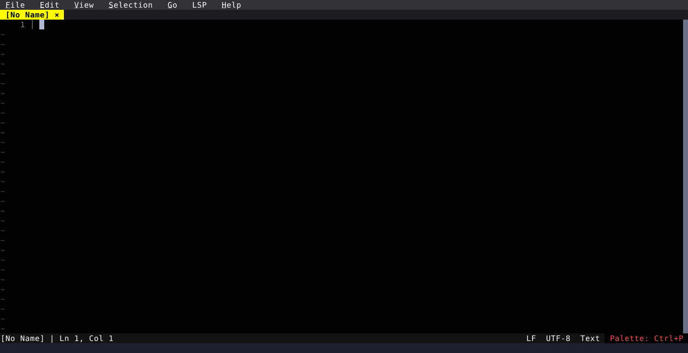

# Review Diff: Polished Magit-Style Git UI

Bordered button toolbar, `[GIT]` sticky header, inline comment bars, card-style comments panel, and `/` file filter.

  

<!-- Generated by: cargo test --package fresh-editor --test e2e_tests blog_showcase_editing/review-diff -- --ignored -->
<!-- Then run: scripts/frames-to-gif.sh docs/blog/editing/review-diff -->
