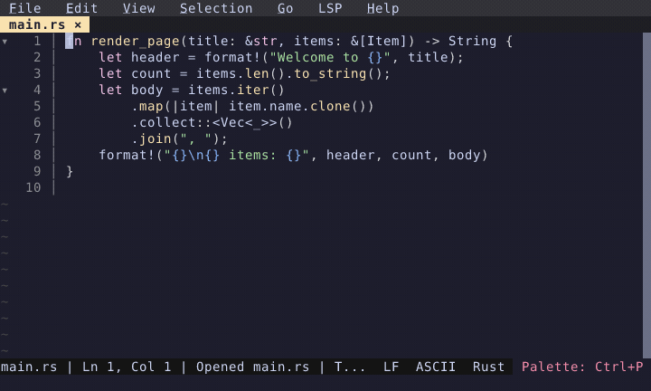

# What's New in Fresh (0.2.18)

*March 23, 2026*

A roundup of everything that landed since the [0.2.9 release](../fresh-0.2.9/) — eight point releases spanning project-wide search & replace, inline diagnostics, 30 new syntax grammars, a ground-up Windows input rewrite, broad LSP coverage, and a long tail of editing refinements and bug fixes.

## Project-Wide Search & Replace

Search and replace across your entire project. Type a query, tab to the replacement field, and press **Alt+Enter** to replace all matches. Handles unsaved buffers, large files, and up to 10,000 results.

This wasn't a trivial feature to build. The initial implementation shelled out to `git grep`, which was fast — but completely broken over SSH remotes since it bypassed our `FileSystem` trait. The rewrite routes all I/O through that trait so search works identically on local and remote filesystems. Large files added another layer: we can't pull a multi-GB file over the network just to search it. Instead, a `HybridSearchPlan` splits each file into loaded (dirty, in-memory) and unloaded regions — unloaded regions are searched on the remote side via chunked reads, and only the matches come back over the wire. Chunk boundaries are tricky: matches can span them, so we overlap adjacent chunks and deduplicate. Eight parallel searchers, bounded by a tokio semaphore, keep throughput high without overwhelming the remote. Every new keystroke cancels in-flight work via an atomic flag, so the UI stays responsive even mid-search.

  

## Inline Diagnostics

Diagnostic messages now appear right-aligned at the end of the offending line. Errors and warnings are visible without opening a panel or hovering — just glance at the code. Staleness detection dims stale diagnostics after edits. Disabled by default; enable "diagnostics inline text" in the Settings UI.

  

## Surround Selection

Select text and type an opening delimiter — `(`, `[`, `{`, `"`, or backtick — to wrap the selection instead of replacing it. For example, selecting `hello` and typing `(` produces `(hello)`. Controlled by the `auto_surround` config option with per-language overrides.

  

## 30 New Syntax Grammars

Dockerfile, CMake, INI, SCSS, LESS, PowerShell, Kotlin, Swift, Dart, Elixir, F#, Nix, Terraform/HCL, Protobuf, GraphQL, Julia, Nim, Gleam, V, Solidity, KDL, Nushell, Starlark, Justfile, Earthfile, Go Module, Vue, Svelte, Astro, and Hyprlang. These grammars are preliminary — please report highlighting issues for your language so we can improve them.

  

## Whitespace Indicators

Granular control over whitespace visibility. Configure space (·) and tab (→) indicators independently for leading, inner, and trailing positions. A new `whitespace_indicator_fg` theme color lets you tune the indicator brightness. Per-language overrides are supported.

  

## Theme Editor Redesign

The theme editor now uses virtual scrolling and mouse support for smooth navigation through large theme files. A new "Inspect Theme at Cursor" command and **Ctrl+Right-Click** popup show exactly which scope and color applies at any position in your code.

  

## Hot Exit

All buffers — including unnamed scratch buffers — persist across sessions automatically. Quit the editor, reopen it, and your unsaved notes are right where you left them. No save prompts, no lost work. Controlled by the `hot_exit` config option (default: on).

  

## Windows Input Overhaul

Windows Terminal support used to be a minefield. Moving the mouse rapidly would dump garbled VT escape sequences — things like `[<35;50;21M` — straight into your document as literal text. The culprit: crossterm's Windows mouse handling replaces the entire console mode with legacy Win32 flags, removing `ENABLE_VIRTUAL_TERMINAL_INPUT` and breaking VT sequence parsing. This made bracketed paste, SGR mouse reporting, and all VT-based input features mutually exclusive with mouse support on Windows.

We replaced crossterm's input layer on Windows with a new `fresh-winterm` crate that uses the same approach as [Microsoft Edit](https://github.com/microsoft/edit): `ENABLE_VIRTUAL_TERMINAL_INPUT` for all input, VT mouse tracking sequences for mouse support, and no legacy `ENABLE_MOUSE_INPUT`. A dedicated reader thread continuously drains the console buffer to prevent overflow under high event rates.

The investigation took several wrong turns. We initially blamed a [known conhost 4KB buffer boundary bug](https://github.com/microsoft/terminal/pull/17738), but that applies to ConPTY pipe input, not direct VT reads. Reading Neovim's and libuv's source code revealed the actual root causes: Windows coalesces repeated `KEY_EVENT` records via `wRepeatCount` under heavy input, and our reader was treating each record as a single byte instead of N bytes. This corrupted the VT byte stream at the parser level. On top of that, mode 1003 (all-motion mouse tracking) generates ~15 KEY_EVENT records per pixel of mouse movement — thousands per second — overwhelming the console input buffer.

The fix has three parts: correct `wRepeatCount` handling, a `strip_corrupt_mouse()` function that detects and discards VT mouse sequences missing their ESC byte (an unambiguous corruption signal, since a human could never type that pattern in a single console read), and a dual mouse mode where Windows defaults to mode 1002 (cell-motion, lower event volume) while macOS and Linux use mode 1003 (full hover tracking). Users can opt into mode 1003 on Windows via the `mouse_hover_enabled` setting.

Bracketed paste, SGR mouse coordinates, and UTF-16 surrogate pairs now all work reliably on Windows Terminal.

## Also New

### Editing

- **Hanging line wrap** — wrapped continuation lines preserve the indentation of their parent line.
- **Smart quote suppression** — quotes typed inside an existing string no longer auto-close, preventing doubled quotes.
- **Separate auto-close config** — `auto_close` toggle to independently control bracket/quote auto-close, skip-over, and pair deletion. Per-language overrides via `languages.<lang>.auto_close`.
- **Read-only mode** — files without write permission and library/toolchain paths automatically open as read-only with a `[RO]` indicator. Override with "Toggle Read Only".
- **Open File jump syntax** — `path:line[:col]` in Open File and Quick Open prompts to jump directly.

### Broad LSP Support

Added LSP configs and helper plugins (with install instructions) for **30+ languages**: Nix, Kotlin, Swift, Scala, Elixir, Erlang, Haskell, OCaml, Clojure, R, Julia, Perl, Nim, Gleam, F#, Dart, Nushell, Solidity, Vue, Svelte, Astro, Tailwind CSS, Terraform/HCL, CMake, Protobuf, GraphQL, SQL, Bash, Lua, Ruby, PHP, YAML, TOML, and Typst. Deno projects are auto-detected.

### Platform

- **macOS native GUI** (early work-in-progress) — exploring a concept of Fresh shipping without a terminal while remaining fully compatible with terminal mode. Currently includes a native menu bar with dynamic conditions, Cmd keybindings, app icon, and `.app` bundle.
- **Linux desktop integration** — icons and `.desktop` files for deb, rpm, Flatpak, and AppImage packages.

### Performance

- Bracket matching caps scanning at 1MB with 16KB bulk reads, preventing hangs on large files.
- Chunked incremental search with viewport-only overlays and 100K match cap for multi-GB files.
- Non-blocking grammar builds on a background thread.
- Native Rust diff indicators replacing JS plugin round-trips.
- Log volume reduced ~90% by default (from ~266MB to ~5-10MB).

### Plugin API

- `registerHandler()` API replacing `globalThis` pattern.
- `restartLspForLanguage`, process limits for `registerLspServer`, async `reloadGrammars()`.
- "Load Plugin from Buffer" — run and hot-reload plugins directly from an open buffer.
- Strict TypeScript across all built-in plugins.

### Quality of Life

- **Workspace storage** — session state always restored on startup, even when opening specific files from CLI.
- **`--wait` flag** — blocks the CLI until the buffer is closed, enabling use as `git core.editor`.
- **Indent-based code folding** — folding works without LSP, using indentation analysis as a fallback.
- **Status bar toggle** — show/hide via command palette.
- **Tab naming** — duplicate tab names disambiguated with appended numbers.
- **File deletion uses trash** — `removePath` uses the system trash instead of permanent deletion.

## Related

- [Full changelog](https://github.com/sinelaw/fresh/blob/master/CHANGELOG.md)
- [All features](/features/)
- [Getting started](/getting-started/)
