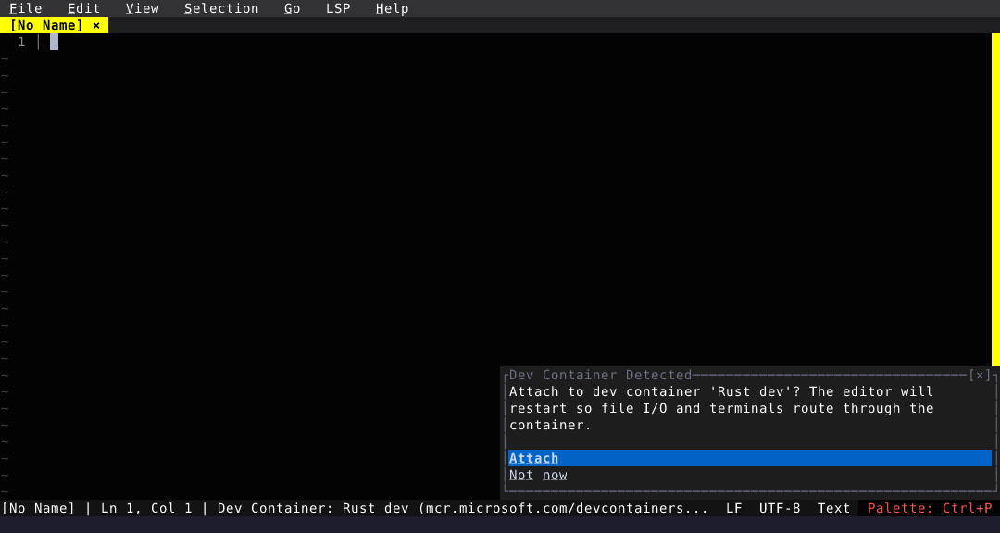

# Devcontainers

Fresh detects .devcontainer/devcontainer.json and surfaces Dev Container commands in the palette. Attach routes filesystem and processes through the container.

  

<!-- Generated by: cargo test --package fresh-editor --test e2e_tests blog_showcase_fresh-0.2.26/devcontainer -- --ignored -->
<!-- Then run: scripts/frames-to-gif.sh docs/blog/fresh-0.2.26/devcontainer -->
