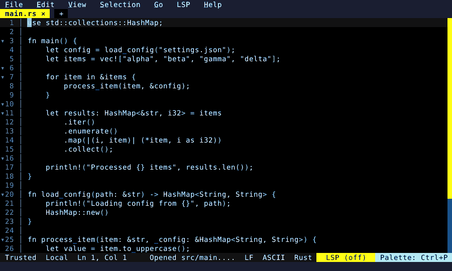

# Wave Screensaver

A decorative wave washes over the editor — a rising sea of glyphs that bounces every cell up, down, and sideways, then settles back.

The screensaver is **off by default**: enable it in the **Settings** UI (`screensaver_enabled`) and it kicks in after `screensaver_idle_minutes` of inactivity. You can also fire it on demand any time — no setup needed — with the **Wave Animation** command.

  

<!-- Generated by: cargo test --package fresh-editor --test e2e_tests blog_showcase_fresh_0_4_0_wave_screensaver -- --ignored -->
<!-- Then run (high-frame-rate, flat-colour → lean palette, no dither):
     scripts/frames-to-gif.sh docs/blog/fresh-0.4.0/wave-screensaver --colors 32 --dither none -->
