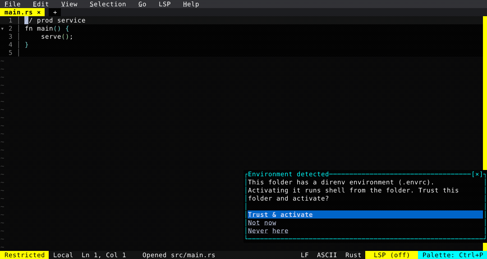

# Workspace Trust

Open a folder that can run code — a project manifest (`Cargo.toml`, `package.json`…), a build script, or a shell environment (`.envrc` / `mise` / `.tool-versions`) — and Fresh raises a full-screen security prompt that names exactly what it found and lets you **Trust folder & Allow Tooling**, **Keep Restricted**, or **Block All Execution**. Trust is per-workspace, surfaced by a clickable `{trust}` element that now leads the status bar: Restricted runs your system tools (git, ripgrep, the system python) but blocks the project's own scripts, env activation, and language servers.

As of 0.4.1 it's **one prompt for everything** — folders with a shell environment no longer get a separate env-manager popup, the trust prompt names the detected env and activates it on trust — and the activated environment applies **uniformly across every backend** (the integrated terminal, Docker, Kubernetes, and SSH), so your terminal sees the same toolchain and env vars as the language servers and formatters.

  

<!-- Generated by: cargo test --package fresh-editor --test e2e_tests blog_showcase_fresh_0_4_0_workspace_trust -- --ignored -->
<!-- Then run: scripts/frames-to-gif.sh docs/blog/fresh-0.4.0/workspace-trust -->
